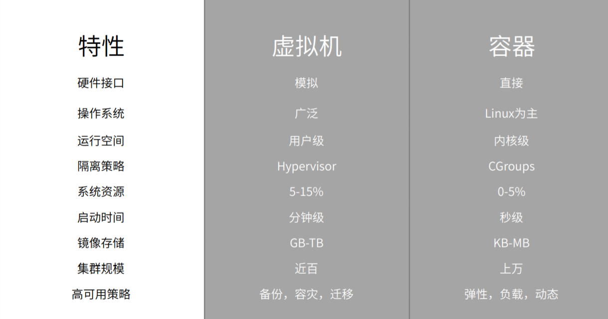
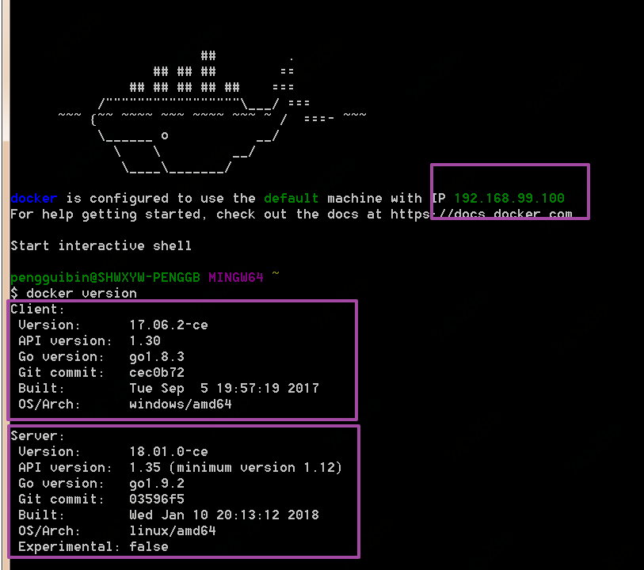

[TOC]

## 一、认识 Docker

### 1.1 Linux 容器（LXC）和 Docker
LXC 是Linux 发展的一种新的虚拟化技术，他的虚拟不是基于硬件层面的，而是对进程的隔离，再正常的进程外面套了一个保护层，封装称一个容器。

Docker 是基于 LXC  的封装，进一步封装了文件系统和网络互联和进程隔离等。Docker 使用 Google 公司推出的 Go 语言进行开发实现，基于 Linux 内核的 cgroup，namespace，以及[AUFS](https://en.wikipedia.org/wiki/Aufs) 类的 [Union FS](https://en.wikipedia.org/wiki/Union_mount) 等技术，对进程进行封装隔离，属于操作系统层面的虚拟化技术。由于隔离的进程独立于宿主和其它的隔离的进程，因此也称其为容器。最初实现是基于 [LXC](https://linuxcontainers.org/lxc/introduction/)，从 0.7 版本以后开始去除 LXC，转而使用自行开发的 [libcontainer](https://github.com/docker/libcontainer)，从 1.11 开始，则进一步演进为使用 runC 和 containerd。

传统虚拟化技术是基于硬件的虚拟化，与传统虚拟化技术不同，


Docker 是基于操作系统层面的虚拟化技术，


相比与传统的虚拟化技术，Docker 具有启动快、占用内存小、轻量、可动态扩容等特点，




### 1.2 Docker 主要用途

1. **提供一次性环境，如本地开发环境、单元测试环境、构建环境等**
2. 弹性云服务，动态扩容
3. 组件微服务架构


### 1.3 Docker 基本概念 —— 镜像、容器和仓库

- 镜像 image
  Docker 镜像是一个特殊的文件系统，除了提供容器运行时所需的程序、库、资源、配置等文件外，还包含了一些为运行时准备的一些配置参数（如匿名卷、环境变量、用户等）。镜像不包含任何动态数据，其内容在构建之后也不会被改变。

- 容器 Container
  容器是镜像的实例，是Docker服务直接操作的对象，容器可以被创建、启动、停止、删除和暂停等。
  容器的实质是进程，运行在属于自己的独立的命名空间。
  容器以镜像为基础层，并在此基础上创建了一个存储层，容器运行时，大部分读写操作都发生在存储层，存储层的生命周期和容器一致，容器销毁时存储层也随之消毁。

  按照 Docker 的最佳实践，容器存储层不应写入任何有效数据，所有文件的写入操作都应该使用数据卷(Volume)、或者绑定宿主目录，这样数据的读写会直接跳过容器的存储层，直接对宿主（或网络存储）发生读写，其性能和稳定性更加高。因此，数据卷是容器数据持久化的一种设计方案。

- 仓库 Registry
  和 Git 仓库类似，仓库是用与存储镜像的，Docker 中仓库名一般有两段路径构成，如  `daocloud.io/nginx` 前者是仓库地址，后者是仓库名称，一个仓库中包含多个标签 Tag,每个 Tag 对应一个镜像。

## 二、Windows 7 安装 Docker

目前 Docker 分为两个发行版，社区版（CE）和企业版（EE），企业版提供一些收费服务，对于我们普通开发者来说，社区版就足以使用，所以我们选择安装社区版就行了。早期的 Docker 是基于 LXC 的，对于 Windows 7，官方提供了 [Docker Toolbox](https://download.docker.com/win/stable/DockerToolbox.exe) 集成工具以方面使用 Docker。 Docker Toolbox 实际上集成了 VirtualBox、boot2docker 和一些 docker 常用工具，如 git、docker-compose、docker-machine 等。从官方下载 [Docker ToolBox ](https://download.docker.com/win/stable/DockerToolbox.exe)，安装即可（如需更加详细的安装教程可自行 Google 或百度之），需要注意的是安装路径不应有中文字符。

一般而言，安装完成之后，点击桌面上的 `Docker QuickStart Terminal` 快捷方式或进入安装目录双击 `start.sh`启动 Docker 服务。启动 Docker 服务后，使用如下命令查看 Docker 相关信息，

```shell
$ docker version

$ docker info
```



如图，Docker 分为客户端和服务端，与 Linux 不同的是 Docker 并不是直接运行在 Windows 系统之上的，而是运行在一个轻量级的 Linux 虚拟机上，这个虚拟机就是之前提到的 boot2docker。图中显示的 IP 地址`192.169.99.100`就是这个虚拟机的 IP，使用 xshell 或类似工具可以 ssh 连接到这台虚拟机上，默认用户名和密码分别是 `docker`和`tcuser`。


小试牛刀，

```shell
$ docker run hello-world
```

`docker run hello-world` 表示启动基于 `hello-world` 镜像容器，如果本地不存在 `hello-world` 镜像那么将从远程镜像仓库 [docker hub](https://hub.docker.com/) 中下载，为了提高下载速度，我们可以手动修改镜像地址为国内镜像。

1. 修改 `profile` 文件

   ```shell
   $ sudo vi /var/lib/boot2docker/profile
   ```

   将`--registry-mirror=https://registry.docker-cn.com `  添加到  `EXTRA_ARGS`中


2. 重启 docker 服务

   ```shell
   $ sudo /etc/init.d/docker restart
   ```


3. 验证

   ```shell
   $ docker info
   ```


## 三、Docker 基本使用

### 3.1 镜像管理

1. 从远程仓库拉取镜像

   >docker pull [选项]  \[地址]/仓库名:[标签]

   其中标签是镜像的标识，有点类似与版本号

   ```shell
   $ docker pull ubuntu:16.04
   ```


2. 查看镜像

   ```shell
   $ docker images
   $ docker image ls
   ```

   【注意】从查看结果中有些镜像没有仓库名也没有标签，这写镜像被成为虚悬镜像（dangling image），这些镜像没有名称一般是因为新镜像构建时与旧镜像同名导致旧镜像名称被占用。

   为了加速镜像构建，Docker 会利用中间层镜像，`docker image ls`只会列出顶层镜像，使用如下命令可以查看到中间层镜像，

   ```shell
   $ docker image ls -a
   ```


3. 删除本地镜像

   ```shell
   $ docker image rm [tag|id]
   ```

   前面提到过的虚悬镜像一般来讲，已经失去了存在的价值，可以用如下命令批量删除虚悬镜像，

   ```shell
   $ docker image prune
   ```

   ​
### 3.2 容器管理

1. 启动一个容器

   > docker run [container]

   ```shell
   >> docker run hello-world
   >> docker run -d nginx
   >> docker run -it --rm ubuntu:16.04 bash
   ```

   - -it：这是两个参数很重要，-t 是启动容器是分配一个伪终端，i 是让容器的标准输入保持打开。我们这里打算进入 bash 执行一些命令并查看返回结果，因此我们需要交互式终端。
   - --rm：这个参数是说容器退出后随之将其删除。默认情况下，为了排障需求，退出的容器并不会立即删除，除非手动 docker rm。我们这里只是随便执行个命令，看看结果，不需要排障和保留结果，因此使用 --rm 可以避免浪费空间。
   - ubuntu:16.04：这是指用 ubuntu:16.04 镜像为基础来启动容器。
   - bash：放在镜像名后的是命令，这里我们希望有个交互式 Shell，因此用的是 bash。
   - -d 是让容器作为宿主机的后台进程运行。

2. 查看容器

   > docker container ls 或 docker ps

3. 停止容器

   > docker [container] stop container_id || docker [container] kill container_id

   ```shell
   $ docker container stop 308bb024a63b
   $ docker stop 308bb024a63b
   $ docker container kill 308bb024a63b
   $ docker kill 308bb024a63b
   ```

4. 进入容器

   >  docker exec [OPTIONS] CONTAINER COMMAND [ARG...]\[flags]

   ```shell
   $ docker exec -it 124f52960169 bash
   ```

5. 删除容器

   > docker [container] rm container_id

   彻底从 `docker ps -a` 列表中删除，`docker start` 不能启动。

   > docker container prune

   清除所有停止的容器。


熟悉以上命令后， 我们进入下一节，《Docker 搭建 PHP 开发环境》。