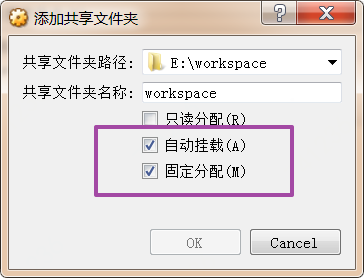
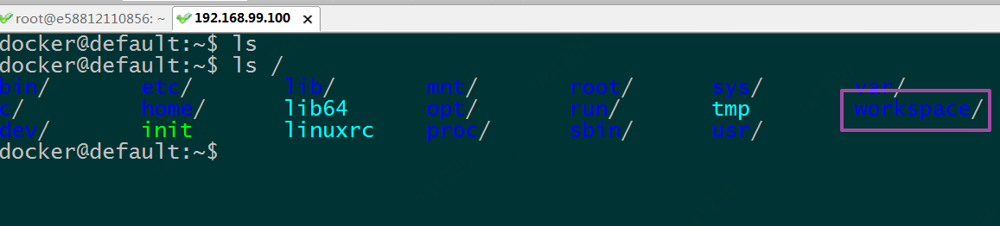
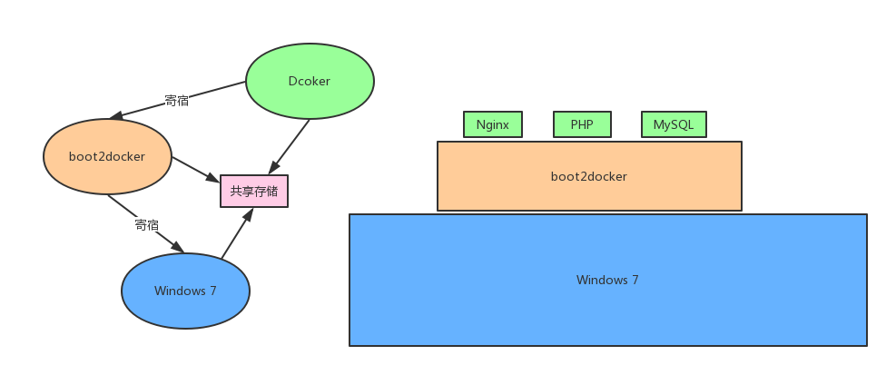

[TOC]
## 一、 Docker 搭建 PHP 开发环境
### 1.1 boot2docker 与 Windows 7 共享存储

假设我们以后我们都在 `E:\workspace` 下做开发，为了使 Docker 容器能访问到 Windows 的 `E:\workspace` 文件夹，首先我们需要将 `E:\workspace` 文件夹共享给虚拟机。

打开 Virtualbox --> 设置 --> 共享文件夹 --> 点击右侧的添加图标，添加共享文件夹，如图，勾选`自动挂载`和`固定分配`选项，点击 'OK' 即可完成文件夹共享。




ssh 远程连接工具登录到 boot2docker 机器上，`ls /` 可查看到共享文件夹。




### 1.2 下载 PHP docker 镜像

进入到共享目录下，执行 `docker image pull php:latest`  拉取 PHP 最新的 docker 镜像，

```shell
$ cd /workspace
$ docker image pull php:latest
```

启动 PHP 容器，

```shell
$ docker images | grep php
$ docker run -dit --name=php-server -v $PWD:/usr/share/html -p 80:80 php:latest
```

其中 -v 是数据卷共享，`-v $PWD:/usr/share/html` 是将宿主机 boot2docker 的当前目录（也就是 /workspace）挂载到 php:latest 这个容器内，因为 `/workspace` 是 boot2docker 的共享文件夹，所以此操作实际上是将 Windows 7 主机的文件夹 `E:/workspace` 挂载到容器内，从而实现 Windows 7 与容器文件共享。关于 docker、boot2docker 和 Windows 7 之间的关系我画了一个图，如下



进入容器，切换到 `/use/share/html` 目录下，ls 查看到的文件与 `E:/workspace`下的文件是一样的，

```shell
$ docker exec -it php-server bash
/# cd /usr/share/html
/# ls
```


### 1.3 启动 PHP 服务器

在容器内的 `/use/share/html` 目录下执行以下命令，即启动 PHP 服务器，

```shell
/# php -S 0.0.0.0:80
```

此后即可切换到我们熟悉的 Windows 系统的 `E:/workspace`  下做开发了。新建 `index.php`，用记事本（或其他编辑器）打开文件，写入以下内容，保存后退出。

```php
<?php
    echo 'hello world';
?>
```

在浏览器中输入 `192.168.99.100`，看到输出内容 'hello world' 就证明我们的环境部署完成了，接下来就可以欲开的学习 PHP 了。