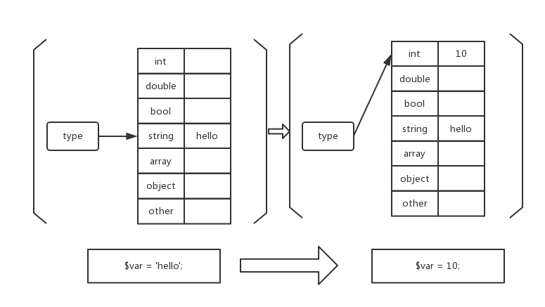
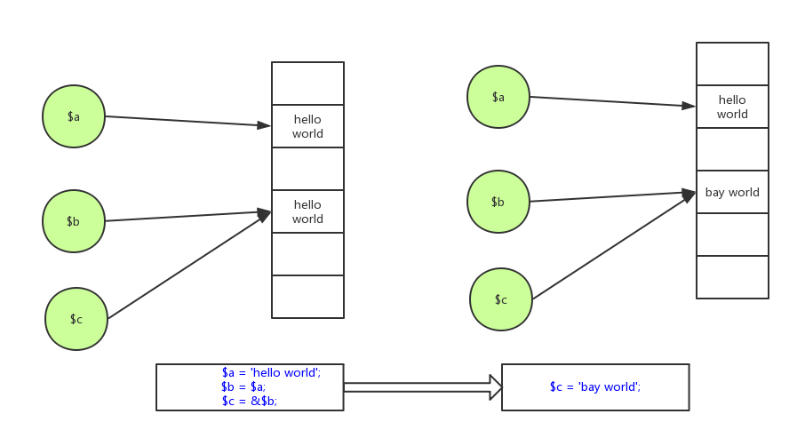

## 变量申明

程序是什么？如果你之前有对编程有了解那么你一定会听说过，程序 = 数据结构 + 算法。

而变量就是为存储数据而生的，变量包括变量名和值，变量名允许以 `[a-zA-Z0-9]`和下划线`_` 任意组合，但不得以数字开头。变量包括申明和赋值，在 PHP 中变量名前面添加 `$`	 即表示申明一个变量。如

```php
$var = 'hello';
```

表示申明变量 `$var` 并将 'hello' 字符串赋值给该变量。PHP 是一种若类型语言，申明变量时不需要申明变量类型，**变量的类型是由其存储的数据类型决定的**。如将 'hello' 字符串赋值给 `$var`后，`$var` 的类型就是 String，如果接下来我们再用整型数据 10 赋值给 `$var`，那么此时的 `$var` 变量会自动转为 `int` 型。

新建 `1.1.php`，内容如下：

```php
<?php

$var = 'hello';
var_dump($var);

$var = 10;
var_dump($var);
```

进入 `1.1.php` 所在目录，执行

```php
# php -f 1.1.php 
string(5) "hello"
int(10)
```

如果有这么一个万能的容器，它可以存储任意的数据类型，每当对这个容器做赋值操作时，我都用一个标志 `type` 记录容器存储的数据类型，也即代表着当前这个容器所存的数据类型，读取值的时候我根据这个 `type` 标志去取对应类型的值就行了，这就是 PHP 变量内部的实现原理（这个容器就是 PHP 解释器 Zend engine 的 zval 结构体）。如图，当 'hello' 赋值给 `$var` 的时候，`$var` 的 `type` 被设定为 `string`， 将 10 赋值给 `$var` 的时候其 `type` 又跟随 10 变为了 `int`，这样就可以实现动态改变一个变量的类型了。




## 变量的赋值

所谓赋值就是将一些将要参与运算的数据暂时用变量存储起来，和大部分编程语言一样，PHP 程序中使用 `=` 对一个变量进行赋值，这里的 `=` 并不是算术意义上的相等，而是代表一种操作，即是将等号右边的数据存储到等号左边的变量中。

```php
<?php
// 赋值
$a = 'hello world'; 		 // 右边的数据是字符常量
$b = $a;					// 右边数据来自一个变量
$c = &$b;					// 引用赋值

$c = 'bay world';
echo '$a:' . $a . "\n";
echo '$b:' . $b . "\n";
echo '$c:' . $c . "\n";

/*
  expect output:
    $a:hello world
    $b:bay world
    $c:bay world
 */
```

常量是组成数据的最小单元，常量可以赋值给变量、变量也可以赋值给变量，需要注意的是变量之间的赋值有量种方式，传值赋值 (copy on write) 和 引用赋值 (change on write)。传值赋值就是赋值一份等号右边的变量`$a`的值给等号左边的变量`$b`，引用赋值是指将等号右边变量值的存储地址给等号左边的变量，两个变量共享一个数据存储空间，任意一个变量对数据的改变都会直接影响到另一变量。

